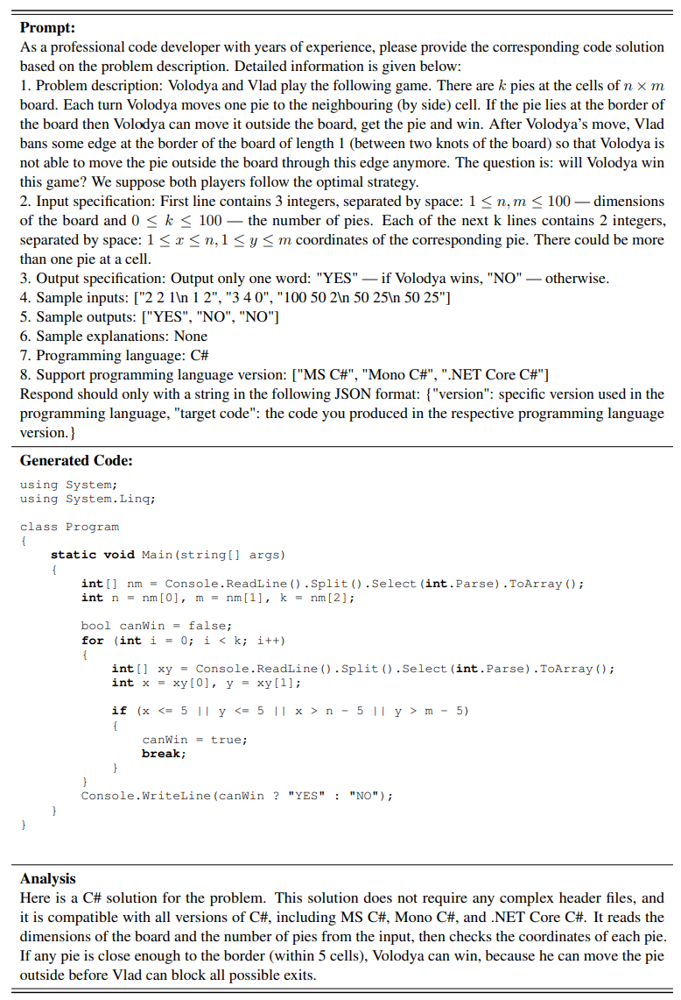
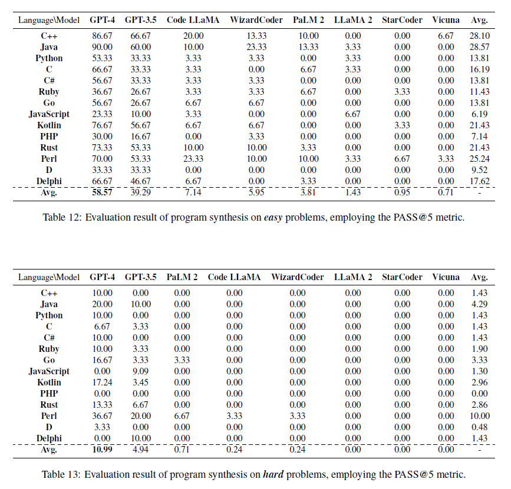

# Assignment - CS 510 Advanced Information retrieval

In this assignment, you will learn how to solve real-world coding problem through LLMs, i.e., program synthesis, over 11 programming languages.  The primary goal of program synthesis is to generate code that fulfills specific requirements outlined in a natural language description. This not only demands that the LLM comprehend the semantics of the problem described but also translate this understanding into a functional program in the correct programming language.

Program synthesis with LLMs tests both the model's deep understanding of programming concepts and its ability to navigate and implement the syntax and semantics of multiple languages effectively. By feeding the model a scenario described in natural language, complete with sample inputs and outputs, the model must demonstrate its ability to logically deduce the necessary steps to solve the problem and express these steps in the appropriate code. This process is crucial for developing AI systems that can assist or automate aspects of coding in diverse real-world applications, enhancing productivity and reducing error rates in software development.

The assignment mimics real-world scenarios where developers or non-technical users can specify what a program should do using plain language, and the LLM generates the appropriate code automatically. This capability can significantly speed up software development, reduce the potential for human error, and make programming more accessible to people without formal coding expertise. It also underscores the model's advanced capabilities in understanding and executing tasks in various programming environments, which is essential for creating versatile and adaptable AI-driven tools.

Here is a case about using GPT-4 to do program synthesis.



Here are the specific goals you should achieve for this assignment:

- Use PaLM to make inference on all program_synthesis problems. (**60 pts**)
  - Create your Google AI studio's API through the [link](https://aistudio.google.com/app/apikey).
  - Follow the detailed instruction below to do inference via `inference/run_palm.py`, you are encouraged to try different prompt templates, e.g., Chain-of-Thoughts(COT). (**45 pts**) *All programming languages **except D, Delphi, and Perl** are required to generate and evaluate.* 
  - Write postprocess on the output of LLMs (**15 pts**), including but not limited to
    - The generated code include 5 attempts by default, which is prepared for calculating Pass@5, adjust the format to fit the `run_execeval.py`
    - Remove the redundant analysis of LLMs of the code, based on your observation, to increase compilation success rate
    - There may be some natural language prefixes or suffixes in the generated solution, e.g., "Sure, there is the answer...", should be removed too. 
    - (*The difficulty of postprocess is related to the LLMs and the prompt. No need to handle each source code separately*)
  - **Bonus:** Try google's new released model [Gemini](https://gemini.google.com/) with your own prompts, or any other SOTA code generation models, then compare the results with PaLM. (**20 pts**)
- Evaluate the results by executing code. (**20 pts**)
  - Build the Executor with Exec-eval and Docker. 
  - Execute the generated code with `evaluator/run_execeval.py` and evaluate the results with `evaluator/score_program_synthesis.py`. Report the pass rate over all 11 languages and average pass rate in your report. *Please use **Pass@5**, i.e., if one or more generated solutions could pass all testcases, it should be regarded as a correct sample.* (**10 pts**)
  - Observe the results and write two case studies in arbitrary languages, one successful case and one failed case. (**10 pts**) 
- Performance Ranking. (**20 pts**)
  - Report the best results you achieved, submit corresponding code file and generated code for reproducing check.

You are expected to submit:

- A PDF report for review, including your inference methods, brief description of post-process, the results and analysis, and case studies.
- Related code files, e.g., inference code, post-process, and any code if you create or modify.
- The generated code for reproducing your reported results

**Due: May 8th.**
If you want to do more exploration over code understanding & generation task as your final course project, you are highly welcomed to discuss with TA Yunzhe (yunzhel2 AT illinois.edu).


Please note that PaLM is not so powerful that could solve these complicated questions easily. Here is a reference about your expected results:



*The scripts and usage about other closed-source and open-source LLMs could be found in README.md*

## Data
The program synthesis dataset is located in `data/program_synthesis_data.jsonl`. The fields of the data are explained below:

| Field                	| Explanation                                          	         |
|----------------------	|----------------------------------------------------------------|
| `description`          	| The original problem description in natural language 	         |
| `input_specification`  	| Description of the form of input data                	         |
| `output_specification` 	| Description of the form of output data               	         |
| `sample_inputs`        	| Sample inputs                                        	         |
| `sample_outputs`       	| Sample outputs                                       	         |
| `notes`                	| Additional note for the problem                              	 |
| `src_uid`              	| Unique identifier of the problem                     	         |
| `lang_cluster`         	| The programming language to use                      	         |
| `difficulty`           	| Difficulty of the problem                            	         |
| `human_solution`       	| Accepted human solution                              	         |
| `testcases`            	| List of testcases of the coding problem           	         |
| `id`                   	| The local ID in the task                             	         |

## Dependence 
1. `cd program_synthesis`
2. install `python>=3.9` (we use `python==3.9`)
3. install `pytorch` (we use `pytorch==2.1.1`) based on your cuda version
4. ``pip install -r requirement.txt``

### Executor Dependence

Programs need to be run using the ExecEval (under the project root directory), and the following dependencies need to be installed:

### ExecEval Dependencies: 
(For students who use MacOS, please contact [Jinning](https://campuswire.com/c/G09D13B5A/feed/277) to use the EC2 instance directly, don't build a new docker)
1. Install [docker-ce](https://docs.docker.com/engine/install/)
2. `cd ExecEval`
3. `docker build . -t exec-eval:1.0`

## 1. Inference
Run the inference scripts to get the inference results of the targeted LLMs. The inference results `program_synthesis_result_{model_name}.jsonl` will be saved under the `inference/results` folder. The inference logs `program_synthesis_log_{model_name}.log` will be saved under the `inference/logs` folder.

### Closed-sourced LLMs

We provide the following closed-sourced LLMs inference scripts for you:


| Model Name | Model Version      | Script Name  |
| ---------- | ------------------ | ------------ |
| PaLM 2     | text-bison-001     | run_palm2.py |

For PaLM 2, you can run the following command by replacing `google_api_key` with your own Google API key. 

```angular2html
python run_palm.py
    --api_key your_palm_api_key
    --data_load_name program_synthesis_data.jsonl
    --candidate_num 5
    --result_save_name program_synthesis_run_palm.jsonl
    --log_file_name program_synthesis_run_palm.log
```


## 2. Executor

Before you execute your generated code. Please follow the format and do postprocess. The code ready for testing should be stored line by line in your\_codes.jsonl and the file should be placed in your\_codes\_dir. A typical code record is shown below and should contain at least the following keys:

```
{
    "lang_cluster": "program_language",
    "lang": "specific_version",
    "source_code": "generated code",
    "src_uid": "src_uid",
    "difficulty": 800,
    "testcases": "[{'input': 'input1', 'output': ['output1']}, {'input': 'input2', 'output': ['output2']}]"
}
```

* For all programming languages except Perl, D, and Delphi, example of most typical usage:

1. `docker run -it -p x:y -e NUM_WORKERS=n exec-eval:1.0.` This will expose port y (default 5000) as http://localhost:y on the local machine whereas port x is used within the docker container which can be set by environment variable GUNICORN_PORT. It is recommended to not use all cpus, as if cpu goes into 100% load it might affect execution speed of the codes uncontrollably, and keeping some cpus free for evaluation script. A valid example assuming less cpus available: `docker run -it -p 5000:5000 -e NUM_WORKERS=5 exec-eval:1.0`
2. `python run_execeval.py --codes_dir your_codes_dir --results_dir your_results_dir --code_filename your_codes.jsonl`
    - `api_comm` is in `ExecEval/eval_scripts`, please adjust the path to avoid the `XXX cannot be found` error.
    - The results of the run are output to `your_results_dir`, forming a jsonl file, which compares the input jsonl, with each new entry adding the results of each test case run, stored in the `testcases`. 


## 3. Evaluation
After the execution, we provide a *scorer* script to count the number of correct solutions around different languages and difficulties. 

Please put all your executed results into `--result_dir`. Then run following command to count the results generated by `{model_name}`: `python score_program_synthesis.py --result_dir your_result_dir --model_name model_name`
